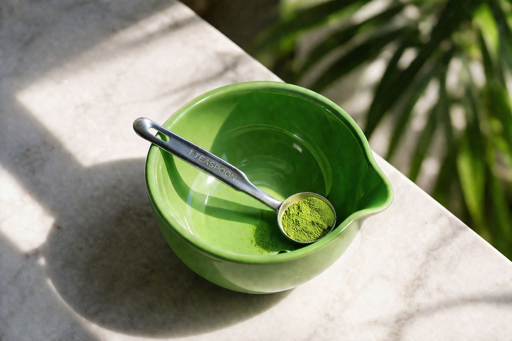
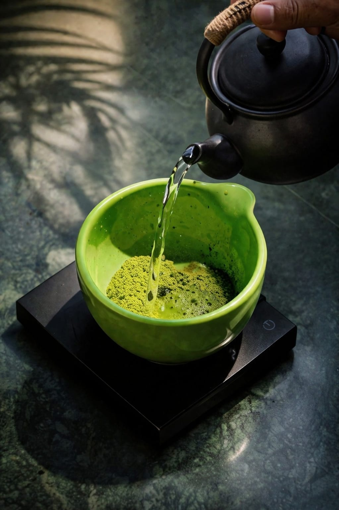
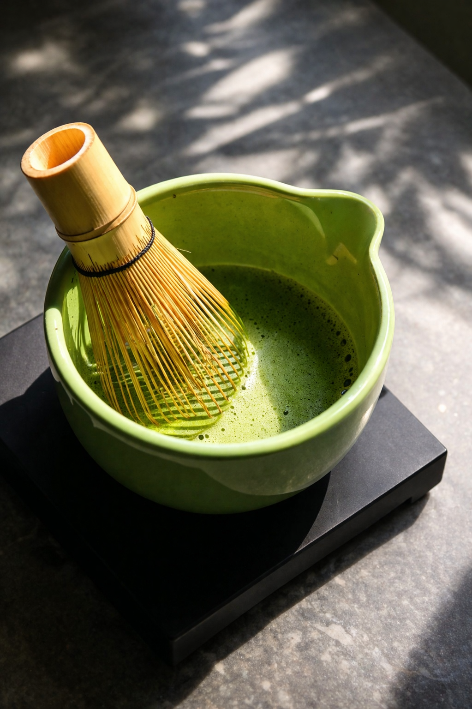
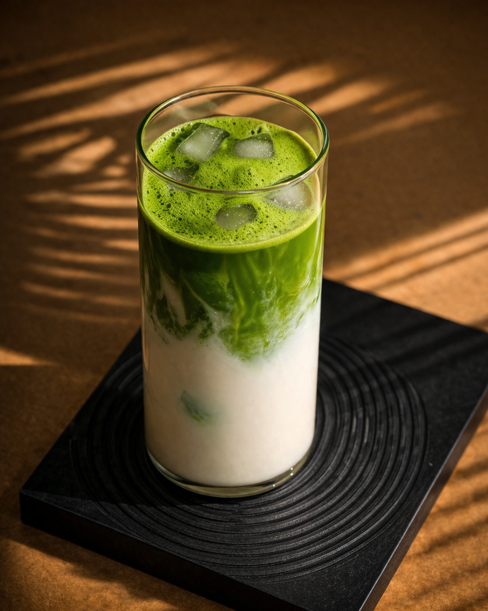

Making matcha at home takes about two minutes once you know the steps. Here's a
beginner-friendly method for a smooth, frothy bowl every time.

## What you'll need

- **Ceremonial-grade matcha** (first-harvest leaves)
- A **bamboo whisk** (chasen), or a small electric frother
- A **bowl** (chawan) or any wide mug
- A **fine sieve** (optional but recommended)
- Hot water at **70–80°C (158–176°F)**

## Step 1: Measure and sift the matcha

Sift **1–2 teaspoons (about 2g)** of matcha into your bowl. Sifting breaks up
clumps so your matcha whisks smooth instead of lumpy.

## Step 2: Add a little water

Add about **60–80ml** of hot, not boiling, water. Boiling water makes matcha
bitter, so let a fresh kettle rest for ~2 minutes first.

## Step 3: Whisk briskly

Whisk in a rapid **"W" or "M" motion** for about **30 seconds**, keeping your
wrist loose. You're aiming for a fine, even layer of foam across the top, not
a slow circular stir.

## Step 4: Drink it fresh

Matcha settles quickly, so enjoy it right away. Give it a gentle swirl if it
starts to separate.

## Want a matcha latte instead?

Whisk your matcha with a small amount of water as above (this is your
concentrate), then pour it over **150–200ml of steamed or cold milk**. Add a
touch of honey if you like. This is where culinary-grade matcha also works
well, but a good ceremonial matcha makes a noticeably smoother latte.

## Common mistakes to avoid

- **Water too hot** → bitterness. Stay below boiling.
- **Skipping the sieve** → clumps.
- **Under-whisking** → no froth, uneven taste.
- **Old matcha** → dull color, flat flavor. [Freshness matters](/blog/why-does-my-matcha-taste-like-grass/).

Ready to taste the difference a first-harvest matcha makes?
[Shop Avora Matcha](https://www.avoramatcha.com/product/ceremonial-matcha).
